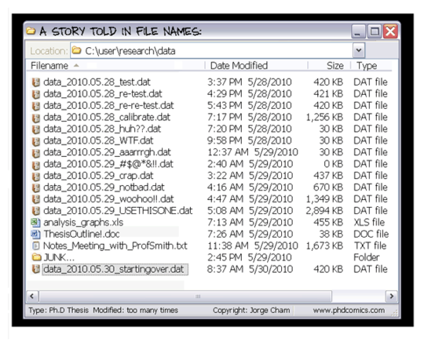
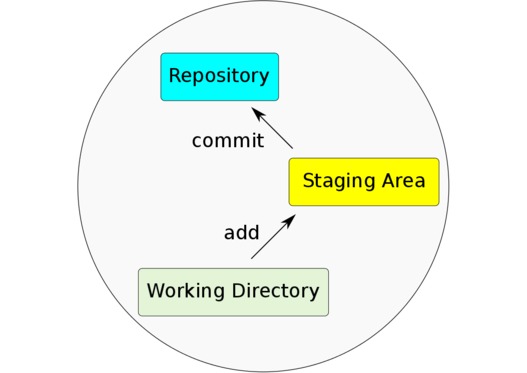
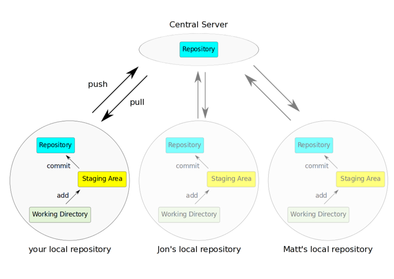
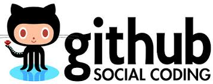

% Git -- Introduction 
% SWC

## Ever Been there?

## The Benefits of Version Control

Version control is a system that records changes to a file or set of files over time so that you can recall specific versions later. The benefits are at hand:

> -   Track incremental backups and recover:  
    Every document can be backed up automatically and restored at a second's notice.

> -   Track every change:  
    Every infinitesimal change can be recorded and can be used to revert a file to an earlier state.

> -   Track writing experiments:  
    Writing experiments can be sandboxed to copies while keeping the main file intact.

> -   Track co-authoring and collaboration:  
    Teams can work independently on their own files, but merge them into a latest common revision.

> -   Track individual contributions:  
    Good VCS systems tag changes with authors who make them.

## git concepts

### working directory

Your working directory holds the one version of your files, usually the most current/latest one.

### commit

A commit is a recorded set of changes in your project's file(s). Try to
group *logical* sets of changes together into one commit -- don't mix
changes which are unrelated.

### staging area (aka index)

Use the staging area to separate these logical sets of changes.

### repository

A repository contains all the history of all the commits to your project.

---

Files are added from the working directory, which always holds the current version of your files, to the staging area. Staged files will be stored into the repository in the next commit. The repository itself contains all previous versions of all files ever committed.

--- 

Distributed Workflow using a centralized repository. Here, three local copies of one central repository allow you, Jon and Matt to work on the same files and sync files between each other using the central server.

## github

GitHub is an online platform that hosts git repositories. Although the git
repository system is decentralized, github can function as a central server,
allowing easy exchange of your repositories. By default a github repository is
free of charge and public - if you want private repositories, you have to pay...

Today, github is much more than just a repository hosting service - it has
built many services on top of git that extend its functionalities: with github,
you can use git without having to touch the commandline or a dedicated GUI
tool, can use it for code reviews, let complete strangers contribute to your
code, allowing you to review their changes and pick which you want to keep,
issue tracking, wiki and more.

## github exercise

> - Create a Repo
>   - add a Readme.md
> - Have a look at the settings (Collaborators, how to delete a repo)
> - Edit & commit Readme.md (Preview Changes first)
> - Edit & commit Readme.md again
> - Show commits / History
> - Add/upload new files

--- 

Optional github exercises:

- Create a branch
- make & commit changes
- create pull request
- merge pull request

## a Glance at git commands 

The git tool has many subcommands that can be invoked like git &lt;subcommand&gt; for instance git status to get the status of a repository.

The most important ones (and hence the ones we'll be focusing on) are:

> - **init**:  initialize a repository
> - **clone**:  clone a repository
> - **status**:  get information about a repository
> - **log**:  view the history and commit messages of the repository
> - **add**:  add a file to the staging area
> - **commit**:  commit your changes to your **local** repository
> - **push**:  push changes to a **remote** repository
> - **pull**:  pull changes from a **remote** repository
> - **checkout**:  retrieve a specific version of a file

you can read more about each command by invoking the help:

    git commit --help
    git help commit

## git Settings

Before we start, we should set the user name and e-mail address. This is important because every git commit uses this information and it's also incredibly useful when looking at the history and commit log:

    git config --global user.name "John Doe"
    git config --global user.email johndoe@embl.de

Other useful settings include your favorite editor as well as difftool:

    git config --global core.editor vim
    git config --global merge.tool meld

## Checking Your Settings

You can use the git config --list command to list all your settings:

    git config --list
    user.name="John Doe"
    user.email=johndoe@embl.de
    core.editor=vim
    merge.tool=meld
    color.status=auto
    color.branch=auto
    color.interactive=auto
    color.diff=auto
    ...

## A Typical git Workflow

### Creating a git Repository

Turning an existing directory into a git repository is as simple as changing into that directory and invoking &lt;init&gt; git init. Here we first create an empty directory called new\_repository and create a repository in there:

    mkdir new_repository
    cd new_repository
    git init

> **note**
>
> As a result, there should be a directory called .git in this directory...

## Cloning a git Repository

Instead of creating a new directory, we can clone a repository. That origin repository can reside in a different folder on our computer, on a remote machine, or on a dedicated git server:

Local directory:

    git clone ../other_directory

Remote directory:

    git clone ssh://user@server/project.git

Remote git server:

    git clone git@server:user/project
    git clone git@git.embl.de:dinkel/linuxcommandline

Checking the Status
-------------------

If you don't know in which state the current repository is in, it's always a good idea to check:

    git status

    # On branch master
    #
    # Initial commit
    #
    nothing to commit (create/copy files and use "git add" to track)

Adding files
------------

First, we'll create a new file:

    echo "First entry in first file!" > file1.txt

    git status

    # On branch master
    #
    # Initial commit
    #
    # Untracked files:
    #   (use "git add <file>..." to include in what will be committed)
    #
    #       file1.txt
    nothing added to commit but untracked files present (use "git add" to track)

Now we'll add this file to the staging area :

    git add file1.txt

    git status

    # On branch master
    #
    # Initial commit
    #
    # Changes to be committed:
    #   (use "git rm --cached <file>..." to unstage)
    #
    #       new file:   file1.txt
    #

This tells us that the file1.txt has been added and can be committed to the repository.

Committing changes
------------------

It might be a bit confusing at first to find out that git add does **not** add a file to the repository. You need to commit the file/changes to do that:

    git commit -m "message describing the changes you made"

> **note**
>
> You **MUST** provide a commit message! git will ignore your attempt to commit if the message is empty.

> If you do not provide the -m parameter, git will open an editor in which you should write your commit message (can be multiple lines of text). Once you save/quit your editor, git will continue to commit...

After succesfully committing, we can check the status again:

    git status

    # On branch master
    nothing to commit, working directory clean

Viewing the History
-------------------

You can use git log to view the history of a repository. All previous commits including details such as Name & Email-address of the committer, Date & Time of the commit as well as the actual commit message are shown:

    git log

    commit  <some hash value identifying this commit>
    Author: <your name and email address>
    Date:   <the actual date of the commit>

    message describing the changes you made

Pushing changes
---------------

If we had cloned this repository from a remote location, we probably want our changes to be propagated to that repository as well. To push all committed changes, simply type:

    git push

> **note**
>
> git "knows" from which location you had cloned this repository and will try to

> push to exactly that location (using the protocol you used to clone: ssh, git, etc)...

> **warning**
>
> If you get a warning message, you probably 'just' need to pull others changes before you are allowed to push your own...

Pulling changes
---------------

To update your local repository with changes from others, you need to pull these changes. In a centralized workflow you actually **must** pull changes that other people have contributed, before you can submit your own. :

    git pull

> **warning**
>
> Ideally, changes from others don't conflict with yours, but whenever someone else has edited the same lines in the same files as you,

> you will receive an error message about a **merge conflict**. You will need to resolve this conflict manually, then add each resolved file (git add) and commit.

Undo local changes
------------------

One of the great features of using version control is that you can revert (undo) changes easily. If you want to undo all changes in a local file, you simply checkout the latest version of this file:

    git checkout -- <filename>

> **warning**
>
> You will loose all changes you made since the last commit!
